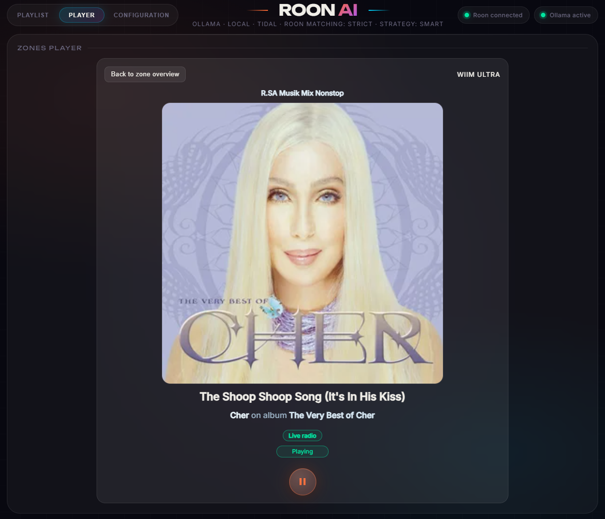

# Roon AI Playlist

**Roon AI Playlist** erweitert ein vorhandenes Roon-System um zusätzliche Werkzeuge für Wiedergabe, Playlisten, Live Radio, Hörbücher, persönliche Hörstatistiken und die Steuerung externer Geräte.

Die Anwendung verbindet sich mit einem Roon Core im lokalen Netzwerk. Sie kann als vollständige Windows-App, im Browser oder über den schlanken Windows-Client **RoonAIViewer** bedient werden.

> Roon AI Playlist ist ein unabhängiges Projekt und steht in keiner Verbindung zu Roon Labs, TIDAL, Last.fm, Deezer, fanart.tv, Audible oder den unterstützten KI-Anbietern.

## Aktuelle Versionen

- Roon AI Playlist: **1.0.458**
- RoonAIViewer: **1.0.3**

## Besondere Funktionen

- KI-gestützte Playlisten mit mehreren wählbaren Anbietern
- direkter Abgleich vorgeschlagener Titel mit der Roon-Bibliothek
- erweiterte Zonenansichten mit Cover, Interpretenbildern, Warteschlange und Restzeit
- Aufbereitung unvollständiger Live-Radio-Metadaten und Cover
- Hörbuchverwaltung mit Kapiteln, Fortschritt und Lesezeichen
- persönliche **Roon Wrapped**-Statistiken mit Show, Story und Export
- Verwaltung fehlender Cover und Interpretenbilder
- frei konfigurierbare HTTP-Netzwerk-Trigger für externe Geräte
- Browseransicht für Tablets, Wanddisplays und entfernte Rechner
- eigenständiger **RoonAIViewer** für Windows mit Tray-Betrieb, Autostart und sicher gespeicherter Verbindung

## Einblicke

### Zonenansicht mit Cover, Warteschlange und Interpretenbild

### KI-gestützte Playlist

### Persönliche Wrapped-Show

### Hörbuch mit Kapiteln und Lesezeichen

### Aufbereitete Live-Radio-Metadaten

## Dokumentation

- [App-Überblick](docs/APP_UEBERBLICK_DE.md)
- [Vollständige Funktionsübersicht](docs/FUNKTIONEN_DE.md)
- [Erste Schritte](docs/ERSTE_SCHRITTE_DE.md)
- [RoonAIViewer – ausführliches Benutzerhandbuch](docs/ROONAI_VIEWER_DE.md)
- [Datenschutz und Sicherheit](docs/DATENSCHUTZ_UND_SICHERHEIT_DE.md)
- [Häufige Fragen](docs/FAQ_DE.md)
- [Versionshinweise](docs/VERSIONSHINWEISE_DE.md)
- [English information](README_EN.md)

## Verfügbarkeit

Dieses öffentliche Informationsangebot enthält keine Installationsdateien und keinen Quellcode. Die Bereitstellung der Anwendung und des RoonAIViewer erfolgt getrennt.
