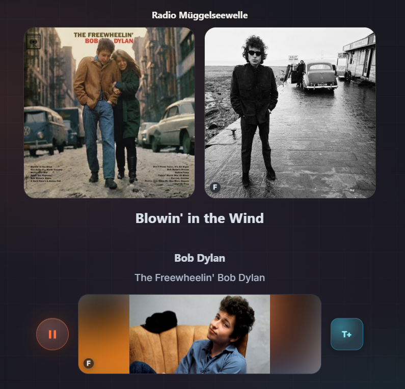
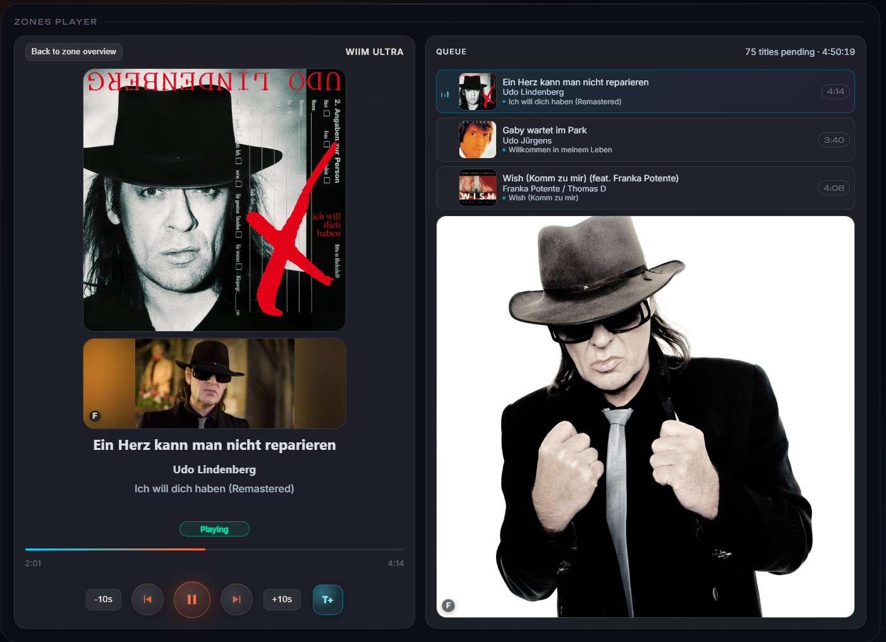
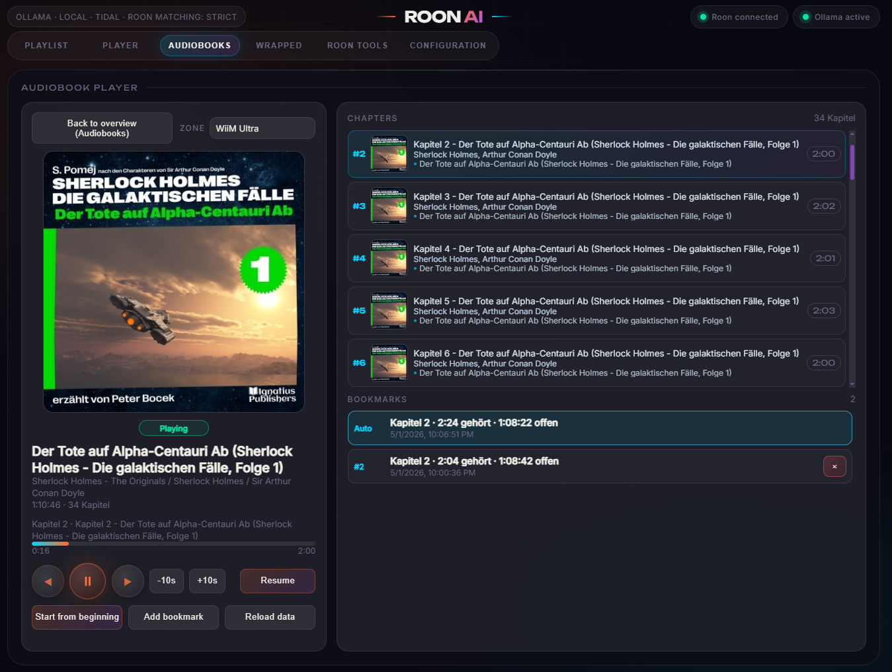
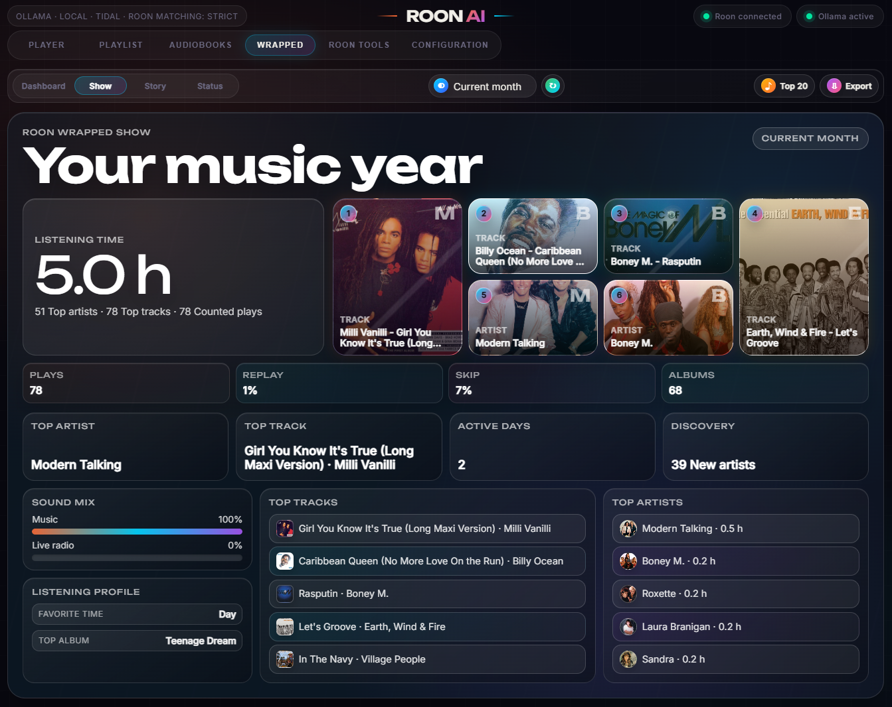

# Roon AI Playlist

**A local companion for Roon that adds intelligent playlist creation, richer live-radio metadata, visual multi-zone control, audiobook tools, personal listening statistics, artwork management, and home-automation actions.**

[Deutsche Version](README_DE.md)

> Roon AI Playlist is an independent project and is not affiliated with, endorsed by, or supported by Roon Labs, TIDAL, Last.fm, Deezer, fanart.tv, Audible, or any supported AI provider.

## Current versions

- Information and documentation release: **1.0.0**
- Roon AI Playlist: **1.0.458**
- RoonAIViewer: **1.0.3**

## What is Roon AI Playlist?

Roon AI Playlist is designed for people who already use Roon and want more control over discovery, presentation, listening history, live radio, audiobooks, and connected devices.

**Roon AI Playlist is not intended to replace the Roon user interface or any of Roon's core functions.** Roon remains responsible for the music library, streaming, RAAT, DSP, zones, queues, and audio playback. This companion was created to make useful workflows available outside Roon where Roon itself does not offer them, as far as the Roon Extension APIs allow. It works with the existing Roon system and sends playback operations back to Roon.

The application runs locally and can be operated in three ways:

- as a complete Windows application on the server computer,
- from a regular web browser on the private network,
- through the lightweight **RoonAIViewer** Windows client on another computer or display.

## What does it add to Roon?

### Intelligent playlist creation

- Describe a desired playlist in natural language.
- Choose Ollama, OpenRouter, OpenAI, Gemini, or Claude as the AI provider.
- Combine the request with genre, decade, mood, energy, and language filters.
- Build playlists from Last.fm, Deezer, maintained tag collections, or Wrapped favourites.
- Match every suggestion against the actual Roon library before playback.
- See successful matches, uncertain results, missing tracks, and possible replacements.
- Play the result in a chosen Roon zone or save it as an M3U playlist.

#### AI playlists with visible Roon matching

The AI source combines an optional free-form description with mood and energy, decade, genre, artist language, target zone, and track count. The selected local or cloud model proposes the music, but the proposal is not sent blindly to playback. Every entry is resolved against Roon first. The result view shows title, artist, energy, year, provider availability, successful and missing counts, and individual replace/remove controls. A verified list can replace the selected zone's queue, be appended, shuffled, or saved for later.

#### Last.fm playlists without an AI prompt

The Last.fm source provides a deterministic alternative based on maintained decade, language, genre, style, and atmosphere tags. Several tags can be combined, the number of tracks and target zone are chosen directly, and the generated candidates go through the same Roon matching and review stage as AI suggestions. The finished list can be played, queued, shuffled, edited, or saved; the chosen tags remain visible in the result heading so its origin is understandable.

### Better live radio metadata

Live-radio streams often provide incomplete, swapped, or incorrectly encoded text. Roon AI Playlist can:

- distinguish station name, artist, track, and album,
- repair common character-encoding problems involving umlauts and apostrophes,
- resolve missing albums and artwork through several metadata providers,
- replace incorrect artist or title information when a reliable match is found,
- distinguish a station logo from real track artwork,
- retrieve artist portraits and wide fan-art backgrounds,
- filter jingles, adverts, news, intros, outros, station IDs, and automation labels,
- save identified tracks to a configured TIDAL playlist with `T+`.

Every station has its own persistent metadata policy:

- **Normal:** enrich the presentation and record the music in Wrapped.
- **Cautious:** use the same search and presentation, but record only when a usable provider result exists.
- **Off:** display only the station information and do not add the item to Wrapped.

### A more visual multi-zone player

- Choose which Roon zones are visible, arrange their order, and show the selected zones together in one dashboard.
- Display artwork, playback state, progress, transport controls, and queue information.
- Show upcoming tracks, remaining track count, and total remaining time.
- Use dedicated views for normal music, Roon Radio, live radio, Spotify streams, and audiobooks.
- Present album cover, artist portrait, and artist background separately.
- Keep browser and viewer displays stable during short Roon reconnects.
- Add the current track directly to a per-zone TIDAL target playlist.

#### Spotify and external playback in Roon

When Roon is playing a Spotify or another external stream, the zone view changes to a presentation suited to the metadata that source actually supplies. Album cover, artist portrait, wide artist artwork, title, artist, and album remain separate visual elements; duration and seek controls are hidden when they would be misleading. Qualified Spotify listening can also be identified as its own source in Wrapped. The application does not log in to Spotify or replace a Spotify client—it presents and records playback that reaches it through Roon.

#### How Spotify reaches Roon: SpotBridge

SpotBridge 1.0.0 is a separate native macOS menu-bar application that connects local Spotify playback to Roon Audio Input. It captures audio from the local Spotify process through a CoreAudio Process Tap and sends the captured signal as AAC or losslessly encoded Ogg-FLAC to a selected Roon zone.

`Spotify on macOS → CoreAudio Process Tap → SpotBridge → Roon Audio Input → selected Roon zone`

SpotBridge forwards artist, title, album, and artwork information and can coordinate Spotify and Roon transport events automatically. Once the resulting stream is available in Roon, Roon AI Playlist can present its metadata and artwork and record a qualified listening session in Wrapped. SpotBridge remains an independent companion application: Roon AI Playlist itself neither captures Spotify audio nor logs in to Spotify.

Ogg-FLAC preserves the captured signal during transmission from SpotBridge to Roon; it does not improve the quality of the original Spotify source.

### Audiobooks inside the Roon environment

- Synchronise Roon albums identified as audiobooks.
- Analyse books containing hundreds of chapters.
- Display chapter count, total duration, current position, and remaining time.
- Resume a book, restart it, or select a chapter directly.
- Store manual and automatic bookmarks independently of the playback zone.
- Keep recognised audiobooks and authors out of music Wrapped and artist-image searches.
- Optionally enrich audiobook metadata and artwork.
- Optionally capture an audiobook through a dedicated local Roon zone and create numbered MP3 chapter files with embedded metadata and cover art.

#### Discovering audiobooks before they are in the Roon library

The audiobook search is a separate catalogue view for finding current German-language releases. It can browse Audible.de or the German National Library catalogue, filter by title, author, keyword, genre, year, and sort order, and show narrator, duration, genres, rating, and an audio-sample action where available. A result can be opened at its original source or passed to the TIDAL search.

The TIDAL audiobook search then looks for matching albums and verifies the album's artist relationship independently. Results show cover, author or artist, year, duration, and track count before an album is added to the personal audiobook list. This also makes a genuine “not available on TIDAL” result distinguishable from a failed provider connection.

### Personal Roon Wrapped

- Record qualified listening sessions from normal Roon playback, live radio, and Spotify streams locally.
- Analyse listening time, sources, time of day, top tracks, top artists, and top albums.
- Distinguish short false starts, skips, and replays.
- Explore Dashboard, Show, cover mosaic, and autoplay Story views.
- Select year, quarter, month, rolling 30/90 days, all time, or a custom date range.
- Start historical tracks directly in a selected Roon zone.
- Export results as PNG, PDF, or CSV.
- Inspect data quality and repair missing albums or covers.

#### Listening history down to the individual track

The **Tracks** view is the inspectable foundation behind the visual summaries. It lists every counted play with cover, title, artist, album, timestamp, source, station where applicable, and effective listening time. The list can be limited by period and by source—Roon, live radio, or Spotify—and a historical title can be sent back to a selected Roon zone. This is also where incorrect or incomplete historical metadata becomes visible instead of disappearing inside an aggregate chart.

### Artwork and artist-image management

- Choose and reorder fanart.tv, TIDAL, Roon, Last.fm, Deezer, and TheAudioDB for artist-image searches.
- Disable individual image providers.
- Search combined artist names and duos before falling back to individual performers.
- Manage portraits and wide artist backgrounds separately.
- Pin a preferred image, reject an unsuitable result for one artist, or upload a custom image.
- Store retrieved images locally and avoid duplicate files.
- Find unresolved Wrapped covers, correct artist/title/album information, and retry only the affected entry.
- Complete missing Wrapped albums, covers, and local image copies through one guided workflow.

### Direct TIDAL tools

- Search TIDAL directly for artists, tracks, and albums.
- Discover My Daily Discovery, numbered My Mixes, New Arrivals, track radio, artist radio, and other personal-radio entries exposed by the connected TIDAL account.
- Start a mix in the selected Roon zone or append it to the current queue.
- Save selected mixes and personal radios as TIDAL playlists, manually or on a scheduled daily synchronisation.
- Exclude video, artist-radio, or track-radio entries when they are not wanted.
- Configure a dedicated TIDAL target playlist for each Roon zone.
- Add the currently playing track or an identified live-radio track through `T+`.
- Keep mix search text and filters in the local application profile.

#### Personal mixes and radio

The mix browser brings the personal TIDAL recommendations that are otherwise spread across several TIDAL surfaces into one filterable overview. Every card identifies its type and seed artists. The target Roon zone is selected once; **Start mix** replaces playback while **Append mix** keeps the current queue and adds the result. Selected entries can be persisted as ordinary TIDAL playlists, and the synchronisation status shows the last run and the number of successful updates.

#### TIDAL playlist browser

The playlist browser searches both TIDAL editorial playlists and the connected user's playlists. Decade, genre, mood, and topic chips can be combined with free text; the source filter can restrict the result to TIDAL or user playlists. Cards show ownership and track count, a preview exposes the first titles before playback, and each result can either start in Roon or be appended to the selected zone.

### Remote actions and external devices

- Configure up to ten shortcuts for live-radio stations, Roon playlists, and zone actions.
- Define multiple independent network triggers for one or more Roon zones.
- Send separate HTTP or HTTPS commands when playback starts and after playback stops.
- Control amplifiers, smart plugs, IR bridges, or home-automation devices.
- Schedule switch-off after pause or stop and cancel it automatically when playback resumes.
- Use a manual OFF control to stop the zone, cancel its scheduler, and switch assigned devices off immediately.
- Optionally use a dedicated Roon dummy zone as a Bluetooth remote-control proxy for play, pause, next, and previous.

#### Ten configurable remote slots

Each slot has an enable switch, label, action, Roon zone, and—when required—a station or playlist target. Toggle behaviour can be enabled for actions such as play/pause. Targets are loaded from the connected Roon system, and every slot can be tested before it is used from the interface or through the protected local HTTP endpoint of an ESP32, IR bridge, or similar controller.

#### Independent network triggers

A network trigger watches one or several zones and owns its own optional ON command, optional OFF command, and switch-off delay. The live status shows the zone group, output state, countdown, last command, response time, and validation result. Several triggers can watch the same zone—for example one for an amplifier and one for a display—without coupling their commands. Tests are explicit, and the safety logic withholds OFF when an assigned zone is active, missing, or uncertain.

#### RoPieee remote-control bridge

RoPieee normally directs remote-control events to one fixed Roon zone. The optional proxy lets it control a dedicated silent dummy zone instead. Three supplied marker tracks encode previous and next, while the dummy zone's transport state represents play and pause. Roon AI Playlist forwards those actions to the most recently active configured music or audiobook zone, remembers the target across restarts if desired, suppresses feedback loops, and displays marker validation and measured acknowledgement latency. Nothing is installed on RoPieee, and volume or mute are deliberately not forwarded.

### Maintenance and reliability

- Create and restore complete application backups.
- Store Wrapped sessions primarily in SQLite while retaining a portable backup snapshot.
- Move the artwork cache to another local drive with verification.
- Inspect service status, storage, caches, provider errors, and Roon connectivity.
- Run extensive metadata requests, image downloads, validation, hashing, and cache work separately so the player, web interface, Roon connection, and network triggers remain responsive.

## RoonAIViewer

RoonAIViewer is a dedicated 64-bit Windows client for a Roon AI Playlist installation running on another computer. It provides the complete interface in its own window without starting another application service or creating another Roon connection.

Viewer features include:

- Windows notification-area operation,
- optional autostart and minimised startup,
- persistent interface zoom from 90 to 130 percent,
- native server and token connection test,
- API-token protection through Windows DPAPI for the current user,
- full reload through the tray menu, `F5`, or `Ctrl+R`,
- automatic recovery when the web page reports an incorrect offline state,
- optional removal of settings and browser data during uninstallation.

See the [complete RoonAIViewer user guide](docs/ROONAI_VIEWER.md).

## Requirements

For normal Windows use:

- 64-bit Windows 10 or Windows 11,
- a reachable Roon Core on the local network,
- authorisation of the extension under **Roon > Settings > Extensions**.

AI playlist generation is optional and can be disabled. Optional integrations include TIDAL, Last.fm, Deezer, fanart.tv, MusicBrainz/Cover Art Archive, TheAudioDB, Audible, and a supported AI provider.

## Local data and network access

The application is intended for a trusted private network. Listening history, audiobook information, configuration, logs, and cached images are stored on the application system. External requests occur only for enabled services and features.

Browser and RoonAIViewer access should be protected with an API token. Application backups may contain credentials and personal listening history and should be stored securely.

## Documentation

- [Complete user guide](docs/USER_GUIDE.md)
- [Features beyond standard Roon](docs/FEATURES_BEYOND_ROON.md)
- [Application overview](docs/APP_OVERVIEW.md)
- [Getting started](docs/GETTING_STARTED.md)
- [RoonAIViewer user guide](docs/ROONAI_VIEWER.md)
- [Privacy and security](docs/PRIVACY_AND_SECURITY.md)
- [Frequently asked questions](docs/FAQ.md)
- [Release notes](docs/RELEASE_NOTES.md)
- [Deutsche Dokumentation](README_DE.md)

## Availability

This information repository contains no installer and no source code. Distribution of Roon AI Playlist and RoonAIViewer is handled separately.
