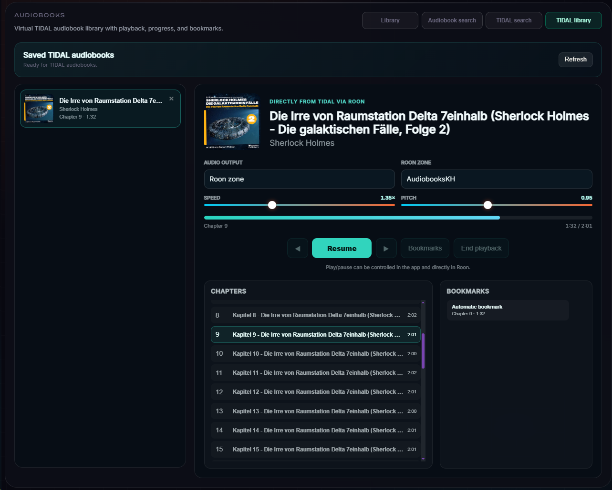
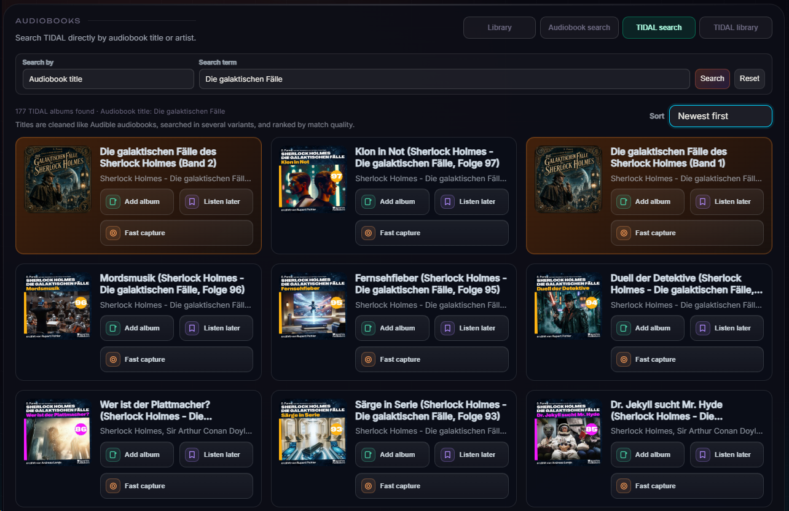

# Application overview

Roon AI Playlist is a local companion application for Roon. It is not intended to replace the Roon GUI, the Roon Core, or any standard Roon function. It was created to make additional workflows available outside Roon where they are missing, within the possibilities and limits of the Roon Extension APIs.

## Ways to use the application

| Interface | Best suited for | Distinguishing features |
|---|---|---|
| Complete Windows application | Computer that also runs the application service | Main window, notification-area operation, and local administration |
| Server + Configuration | Always-on application computer operated remotely | Full central service, local configuration on demand, no permanent local Player window |
| Web browser | Tablets, wall displays, and computers on the home network | no additional client installation required |
| RoonAIViewer | permanent Windows display connected to a remote server | dedicated window, notification area, autostart, persistent zoom, and encrypted token storage |

All display clients use the same zone and media information supplied by the application service. Server + Configuration changes only the local desktop presentation; it does not remove service functions. Browsers and the Viewer create no additional Roon connection.

## Main areas

### Playlist

Playlists can be created from free-form music requests, tags, Last.fm recommendations, Wrapped favourites, or one exact played recording. For a Wrapped seed, the configured AI provider derives a visible narrow profile covering genre, sung language, style, instrumentation, production era, vocals, and energy; automatic providers audit every suggestion against it. AI requests may use local or API-based providers, the guided ChatGPT Work hand-off, or the fully automatic Google Antigravity CLI. Antigravity needs no API key and can use current high-quality models from Google's free tier after a one-time sign-in. Before playback, the application checks which tracks are actually available in Roon.

Roon Radio remains the simpler choice for an effortless continuous stream. The Wrapped-seeded workflow is the controlled alternative: exact starting recording, explicit constraints, a finite preview, independent candidate checks, and a result that can be edited, saved, and reproduced before a Roon zone is selected.

### Player

The player displays a configurable selection of Roon zones with user-defined order and layout, playback state, artwork, metadata, artist images, progress, and queues. The normal Player and large Browser views can have separate visible-zone selections. Live radio, Spotify streams, and audiobooks receive purpose-built layouts and controls.

### SpotBridge and Spotify

SpotBridge 1.0.0 is a separate native macOS menu-bar application that captures the local Spotify process through a CoreAudio Process Tap and supplies the signal to Roon Audio Input as AAC or losslessly encoded Ogg-FLAC. It forwards artist, title, album, and artwork and can coordinate Spotify and Roon transport. Roon AI Playlist then presents and records the playback after it becomes available in a selected Roon zone; it does not perform the Spotify capture itself.

### Audiobooks

Audiobooks from Roon are managed with chapters, total duration, progress, and bookmarks. A separate Audible/DNB catalogue and a direct TIDAL search by title or artist support discovery. TIDAL results can be added to a virtual **Listen later** library, played directly through Roon Audio Input or a selected Windows/USB Bluetooth output, and resumed with automatic or manual bookmarks. Speed and pitch are independently adjustable in 0.05 steps.

Fast capture uses a guided audio and Chrome-companion setup, prefers a verified 4× profile with a 2× compatibility fallback, and displays a complete job status with chapter-boundary pause, resume, and abort controls. Other TIDAL playback is locked while capture is active. The resulting master recording is restored to normal speed and split into tagged MP3 chapter files.

### Wrapped

Wrapped records qualified listening sessions locally and presents listening time, tracks, artists, albums, sources, time of day, skips, and replays. Dashboard, Show, Story, Status, and a filterable track-level history are available for multiple date ranges. Selecting a historical recording opens one action for direct Roon-zone playback or a tightly profiled AI playlist. The open action automatically picks up zones that return while Roon reconnects; exports and repair tools address missing albums and artwork.

### Direct TIDAL tools

Personal mixes, Daily Discovery, track radio, artist radio, editorial playlists, and user playlists can be filtered, previewed, started, or appended in a selected Roon zone. Selected dynamic mixes can be synchronised into stable TIDAL playlists, while `T+` stores the current or identified live-radio track in a target playlist assigned per zone. The separate audiobook search prepares covers and album details, supports broad series-aware title matching, up to 200 results, and sorting including oldest first.

### Roon Tools

Roon Tools combines live-radio stations, Roon playlists, queues, and configurable remote actions. Each station can have its own external-metadata policy.

### Remotes and external devices

Ten configurable action slots can start stations, playlists, or zone actions from the interface or compatible local hardware. Independent network triggers connect zone playback to HTTP-controlled amplifiers, smart plugs, IR bridges, or automation systems. An optional RoPieee dummy-zone proxy forwards play, pause, next, and previous to the most recently active music or audiobook zone.

### Configuration and maintenance

This area manages connections, optional services, interface settings, Wrapped, audiobooks, image providers, network triggers, backups, diagnostics, and the desktop operating mode. In Server + Configuration mode it can be opened locally from the Windows notification area and is released again when closed.

## Local operation

The application is intended for use on a private local network. Roon, Wrapped, audiobook, and cache data is managed locally. External requests occur only for enabled services and features, such as AI providers, TIDAL, or artwork and metadata providers. With Antigravity, the local application starts the CLI on the same Windows system; Google processes the submitted playlist request under the signed-in Antigravity account and its current terms and limits.
