# Features beyond standard Roon

[Deutsche Version](FEATURES_BEYOND_ROON_DE.md) · [Back to overview](../README.md)

Status: Roon AI Playlist `1.0.466`, August 13, 2026.

This overview lists capabilities that **Roon AI Playlist** adds beyond standard Roon. It is not a proposed replacement for the Roon GUI or any Roon function. The companion exists only to provide useful workflows outside Roon where they are missing, as far as the Roon Extension APIs permit. The comparison assumes Roon without third-party extensions, scripts, or home-automation systems. Roon's own core capabilities—including RAAT playback, DSP, regular zone control and grouping, library management, Roon Radio, normal playlists, TIDAL playback, History, album artwork, Sleep Timer, Roon Display, and Roon database backups—are deliberately not counted as application advantages.

## 1. AI and external playlist generation

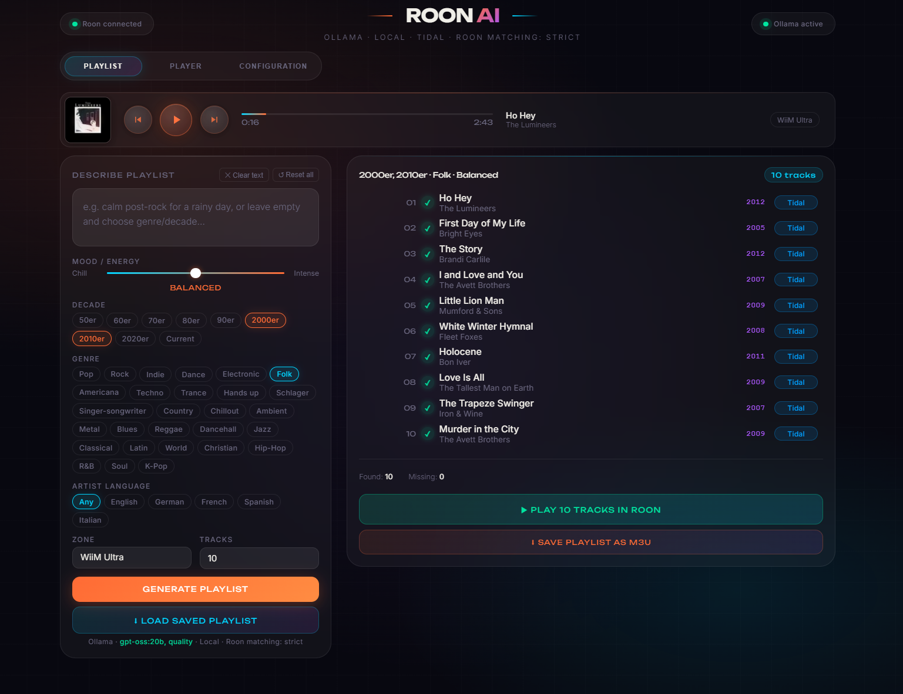

- Generate playlists from free-form natural-language requests.
- Select Ollama, OpenRouter, OpenAI, Gemini, Claude, guided ChatGPT Work, or fully automatic Google Antigravity CLI generation.
- Use high-quality current Antigravity models without an AI API key or usage-based API account; Google's free tier and its limits apply.
- Choose Gemini effort variants from a real selector, load account-specific models through `agy models`, or enter a future custom model ID.
- Combine prompts with genre, decade, mood, and language filters.
- Compare multiple local models in the model bake-off.
- Generate suggestions from Last.fm, Deezer, and maintained tag lists.
- Edit and validate custom grouped tag lists.
- Match candidates against the actual Roon library and expose match confidence.
- Find replacement tracks for missing or uncertain candidates.
- Use Wrapped Top 20 as a playlist source.
- Save, load, and validate M3U results.

AI generation remains a proposal stage: the chosen model, structured filters, and optional free text produce candidates, while the application exposes every Roon match before playback. Individual entries can be auditioned, replaced, removed, or queued, and the complete verified result can start or extend a zone queue. In Antigravity mode this whole path is automatic after the one-time Google sign-in: no prompt copying and no API key are required. The application never buys credits and blocks already enabled paid G1/AI credits unless the user explicitly permits them.

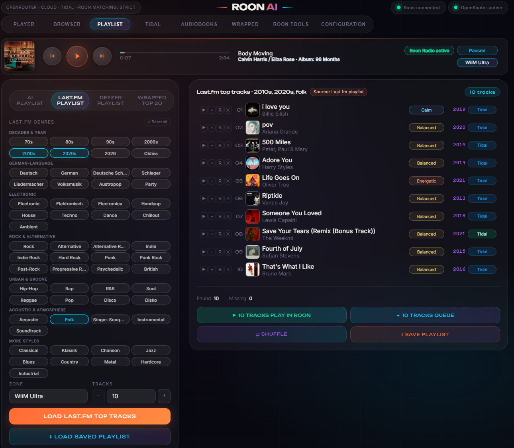

Last.fm playlists use maintained decade, language, genre, style, and atmosphere tags instead of requiring an AI prompt. Several tags can be combined and the popular candidates pass through exactly the same visible Roon matching and editing workflow.

Roon provides its own recommendation engine through Valence and Roon Radio and manages conventional playlists, but it does not provide free-form multi-provider AI playlist generation. See [Roon Valence](https://help.roonlabs.com/portal/en/kb/articles/valence) and [Roon Playlists](https://help.roonlabs.com/portal/en/kb/articles/playlists).

## 2. Direct TIDAL tools

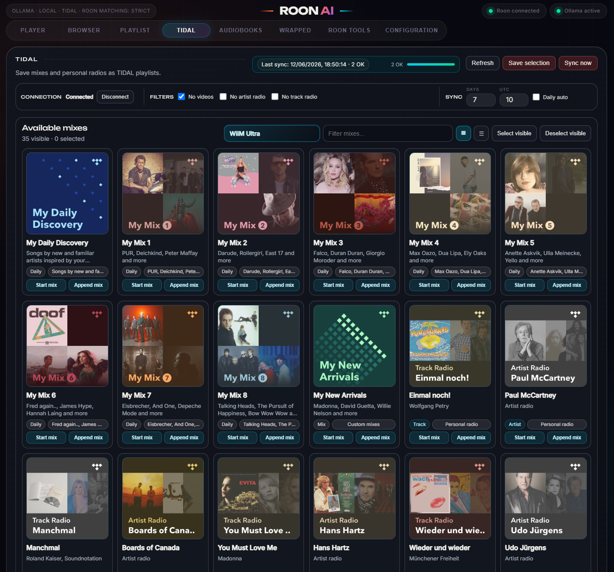

- Search TIDAL directly through API V2.
- Resolve artist, track, and album relationships separately.
- Transfer TIDAL mixes with custom exclusion filters.
- Configure a dedicated TIDAL target playlist for each Roon zone.
- Add the current track to that target with `T+`.
- Save identified live-radio tracks to TIDAL.
- Persist mix search text and exclusions in the local app profile.

Personal discovery is not limited to a text search. My Daily Discovery, numbered My Mixes, New Arrivals, track radio, and artist radio can be reviewed together, started or appended in a selected Roon zone, and selectively synchronised into stable TIDAL playlists. Video and radio categories can be excluded from that synchronisation.

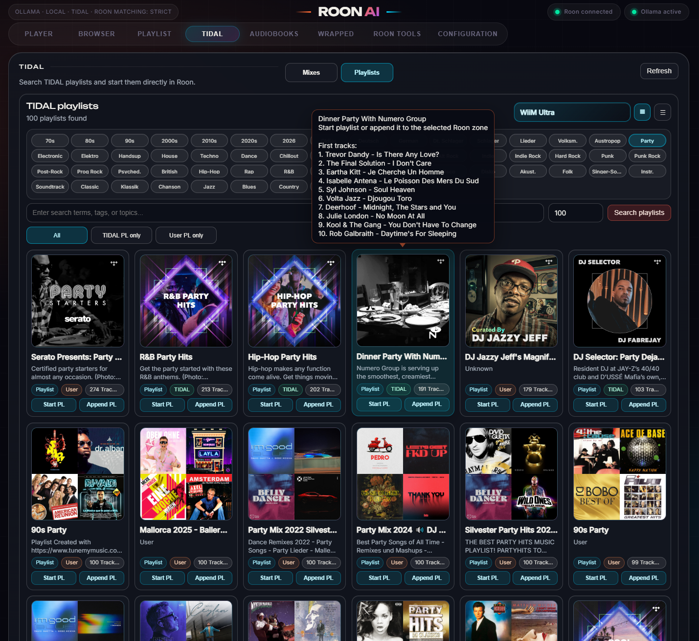

The playlist view combines free text with decade, genre, mood, topic, and ownership filters. A preview reveals the first titles before a playlist replaces or extends the Roon queue.

Roon explains that its TIDAL view is not a live pass-through of the current TIDAL client and instead uses a periodically generated Roon database. See [TIDAL in Roon](https://help.roonlabs.com/portal/en/kb/articles/tidal).

## 3. Live-radio metadata and artwork

- Detect and canonicalize swapped station, artist, title, and album fields.
- Repair broken umlauts, apostrophes, and other characters.
- Resolve missing albums from artist and title.
- Enrich metadata and artwork through TIDAL V2, stored matches, MusicBrainz/Cover Art Archive, Last.fm, and Deezer.
- Prioritize explicit Roon albums and downgrade unsuitable compilation, best-of, soundtrack, live, or remaster candidates.
- Replace incorrect station values with safely resolved artist and title identities.
- Reject jingles, adverts, news, intros, outros, station IDs, and technical automation labels before provider search.
- Distinguish track artwork from the Roon station logo and keep stable local copies.
- Store a persistent `Normal`, `Cautious`, or `Off` policy per station and display it as `N`, `V`, or `A`.
- In Cautious mode, exclude uncertain results only from Wrapped without changing search or display behavior.

Roon documents that Live Radio can normally display only metadata embedded in the audio stream. See [Live Radio in Roon](https://help.roonlabs.com/portal/en/kb/articles/live-radio).

## 4. Cover and artist-image management

- Freely order fanart.tv, TIDAL, Roon, Last.fm, Deezer, and TheAudioDB for artist-image lookup.
- Disable individual providers only for artist imagery.
- Manage profile images and wide artist backgrounds separately.
- Mirror images locally, deduplicate by content hash, and display their source.
- Resolve multi-artist credits as one identity first and split only after the complete identity misses.
- Present multiple artist images as a coordinated slideshow.
- Reject a result for one artist, pin a preferred choice, or upload a custom image.
- Run a targeted refresh for one artist.
- Backfill missing Wrapped albums and covers and store external artwork locally.
- Manage unresolved covers in groups, edit metadata, retry one item, or safely delete confirmed Wrapped plays.

Roon can identify library albums and accept custom album artwork, but it does not provide this configurable external provider chain or the Wrapped repair workflow. See [Identifying albums](https://help.roonlabs.com/portal/en/kb/articles/identifying-albums) and [Changing album artwork](https://help.roonlabs.com/portal/en/kb/articles/faq-how-do-i-change-the-cover-art-of-an-album).

## 5. Audiobook management and capture

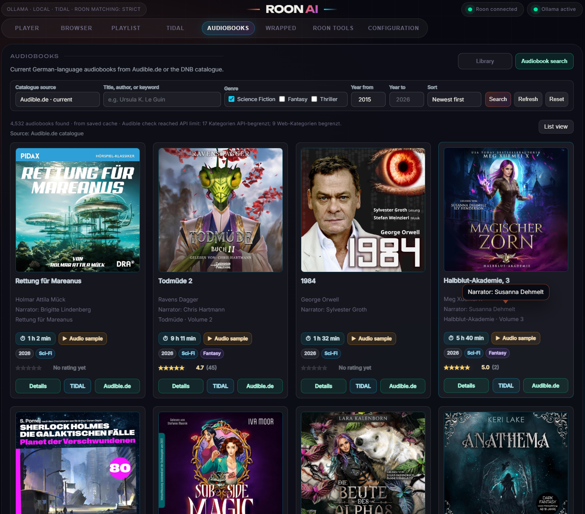

- Synchronize Roon albums as audiobooks and fully analyze books with hundreds of chapters.
- Maintain chapter count, total duration, and local listening progress.
- Resume, restart, or play a selected chapter.
- Store manual and automatic zone-independent bookmarks.
- Add Audible metadata and artwork.
- Keep audiobooks and their authors out of Wrapped and music artist-image searches.
- Start a known book automatically in an exclusive local Roon capture zone.
- Validate FFmpeg, FFprobe, `libmp3lame`, VB-CABLE, the Roon zone, destination, and free space first.
- Record continuous master segments in a separate supervised process.
- Split observed Roon chapter transitions afterwards into numbered 192 kbit/s CBR MP3 chapters.
- Write title, author, album, track number, and front cover into each chapter file.
- Queue, cancel, and resume a pause at a chapter boundary.
- Display recording and processing progress, remaining time, process state, and failures.
- Preserve master segments as visible rescue files after a real failure.

The discovery catalogue can be filtered by author, title, keyword, genre, year, and source and can expose narrator, duration, rating, sample, and source links. A catalogue result can then open a dedicated TIDAL search rather than assuming that the audiobook is available there.

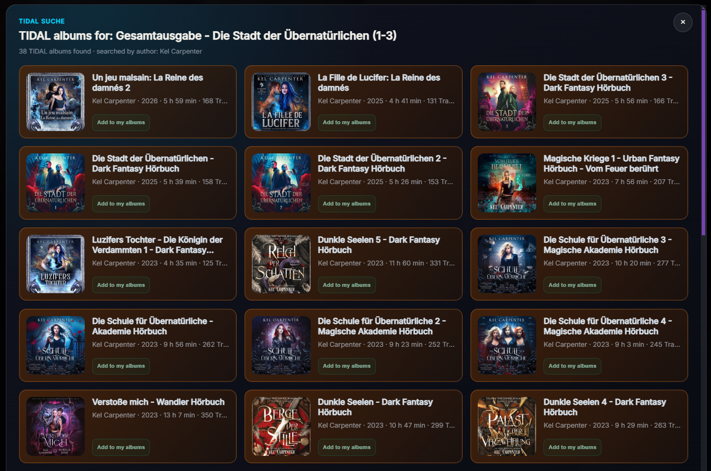

TIDAL album candidates are cross-checked through their artist relationship and presented with edition details before they enter the application's audiobook list. Empty availability and provider failure are separate outcomes.

## 6. Roon Wrapped

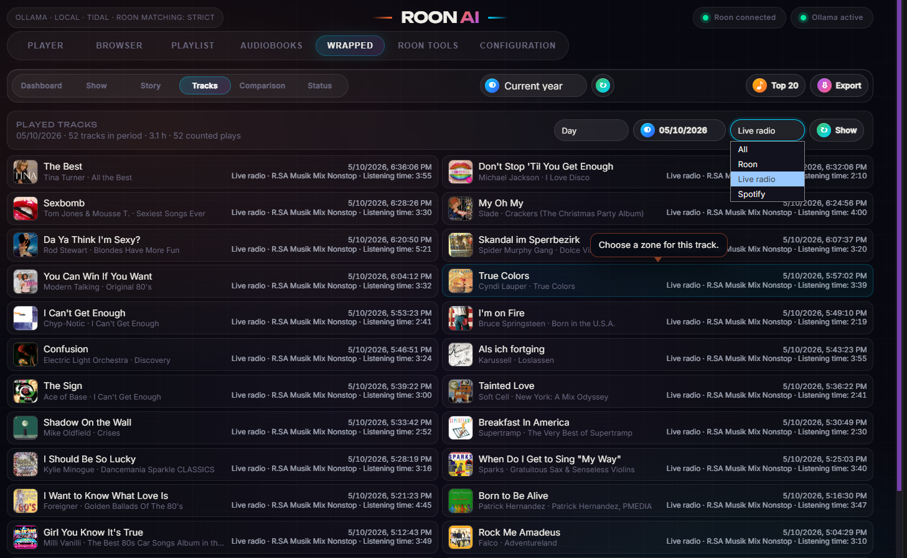

- Record qualified listening sessions from Roon, Live Radio, and Spotify streams locally.
- Distinguish short false starts, skips, and replays.
- Analyze listening time by time of day and source plus top tracks, artists, and albums.
- Present Dashboard, Show, cover mosaic, and an autoplay Story.
- Filter by year, quarter, month, rolling 30/90 days, all time, or custom ranges.
- Start a historical result directly in a selected Roon zone.
- Expose data quality, cover coverage, and missing metadata.
- Export PNG, PDF, and CSV files and keep an export history.
- Repair historical metadata, albums, and artwork automatically.
- Store sessions primarily in SQLite with a portable JSON snapshot.

The Tracks view keeps the analysis auditable: each counted play retains title, artist, album, timestamp, source, station, cover, and effective listening time. Date and source filters can isolate Roon, Live Radio, or Spotify, and a historical item can be resolved and replayed in a chosen Roon zone.

Roon stores listening history and play counts, but does not provide this standalone Story, export, and repair environment. See [Data stored in Roon backups](https://help.roonlabs.com/portal/en/kb/articles/what-is-a-backup-in-roon).

## 7. External-device and home-automation control

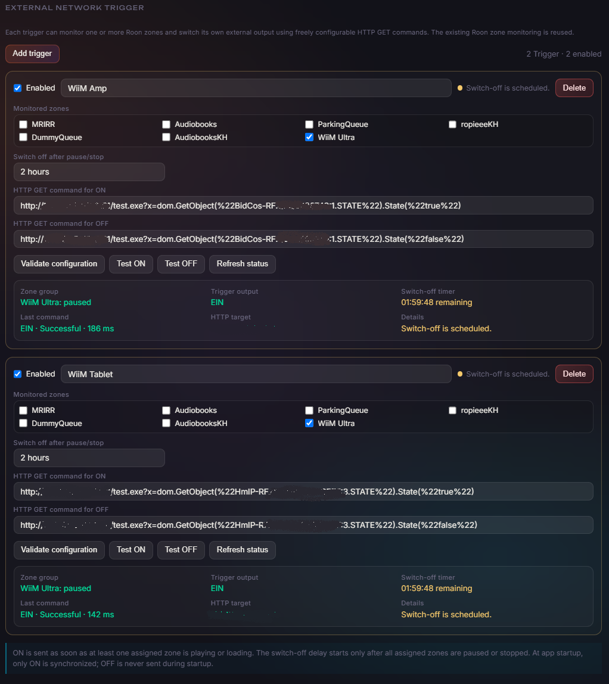

- Configure multiple independent network triggers, each monitoring one or more Roon zones.
- Send arbitrary HTTP or HTTPS `ON` and `OFF` commands.
- Use ON-only, OFF-only, or bidirectional configurations.
- Power amplifiers, smart plugs, IR bridges, or home-automation actuators when playback starts.
- Start a 15-minute to eight-hour switch-off timer after pause or stop.
- Cancel the timer when playback resumes and fail safely when an assigned zone is missing.
- Display and test countdown, state, last command, latency, and success.
- Override a running scheduler with the manual OFF button, stop the Roon zone, and power all assigned devices immediately.

Roon's Sleep Timer stops or fades playback for a zone; it does not send arbitrary network commands to external devices. See [Roon Sleep Timer](https://help.roonlabs.com/portal/en/kb/articles/sleep-timer).

## 8. External remotes and action slots

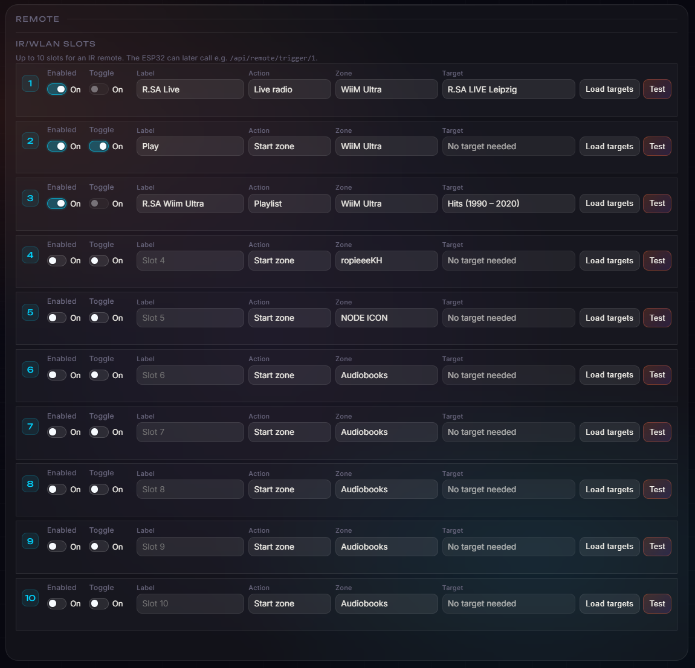

- Configure up to ten shortcuts for Live Radio, Roon playlists, and zone actions.
- Trigger slots in the app or through a protected HTTP API from ESP32, IR, or similar local controllers.
- Use a dummy Roon zone as a Bluetooth remote-control proxy.
- Forward play, pause, next, and previous to the most recently active music or audiobook zone.
- Distinguish marker movement, natural track completion, and feedback loops.
- Display target zone, marker, last command, and acknowledgement latency.

The ten numbered slots and the dummy-zone proxy solve different problems. Slots expose explicit actions to the interface or a protected local HTTP endpoint. The proxy translates the transport events of a remote-controlled silent Roon zone into actions for whichever configured music or audiobook zone was active most recently.

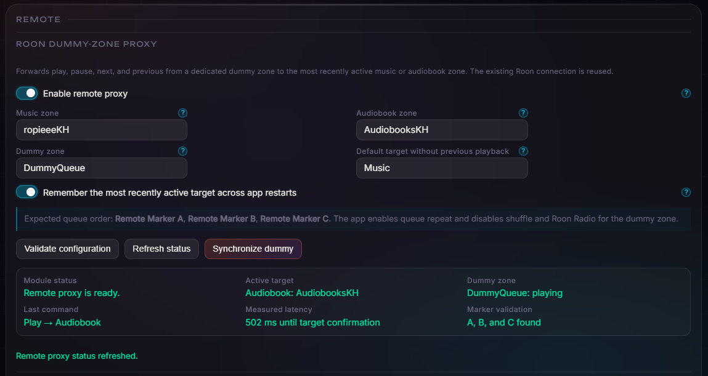

This makes a RoPieee-connected Bluetooth remote useful across two changing destinations without installing custom software on RoPieee. Three marker tracks encode navigation; validation, feedback suppression, target persistence, and measured acknowledgement are handled by the companion. Volume and mute are not part of this proxy.

## 9. Player, browser, and viewer

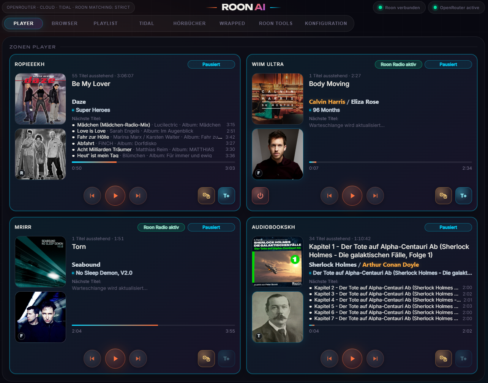

- Configure which Roon zones are visible, arrange their order and column layout, and display the selected zones simultaneously with artwork, state, progress, transport, and queue.
- Show up to six upcoming tracks plus remaining count and time directly per zone.
- Use dedicated presentations for normal music, Roon Radio, Live Radio, Spotify, and audiobooks.
- Present cover, artist profile image, and artist background separately.
- Provide a complete control interface in a normal LAN browser.
- Use the lightweight Windows WebView2 viewer with tray behavior, startup, zoom, and a DPAPI-protected token.
- Install the central application in Server + Configuration mode when remote clients are used, keeping every background function while avoiding a permanently loaded local Player window.

The operating mode is selectable during Windows installation and can be changed later in Configuration. Server mode still provides Roon control, Wrapped recording, network triggers, media processing, scheduled tasks, and audiobook capture. Its local configuration window is opened only when needed and released after closing, while browsers and RoonAIViewer continue to receive the complete interface.

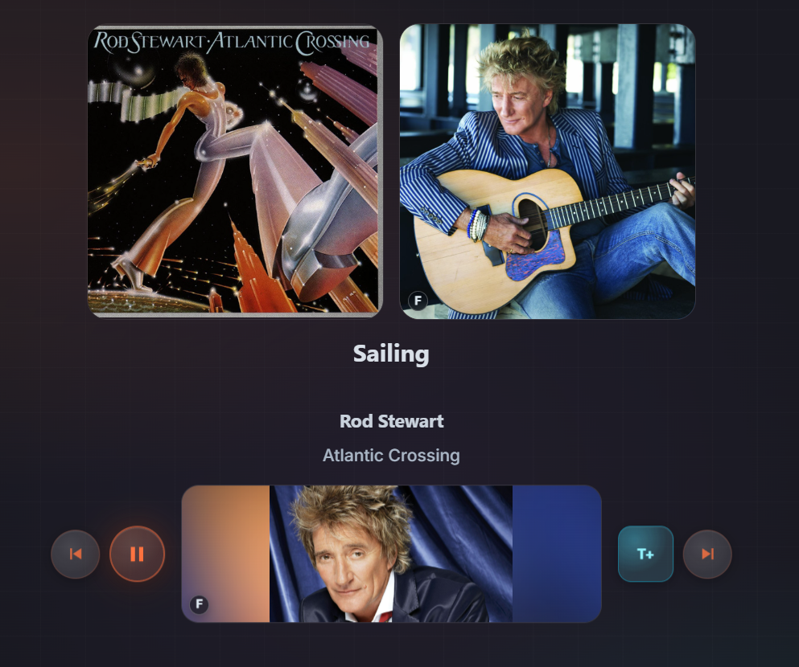

Spotify and other external playback is shown only when it reaches the application through Roon. The companion does not become a Spotify client; it adapts the presentation to the supplied stream data and records qualified Spotify sessions as a distinct Wrapped source.

The separate native macOS application SpotBridge can provide that path for local Spotify playback. It captures the Spotify process through a CoreAudio Process Tap, supplies the captured signal to Roon Audio Input as AAC or losslessly encoded Ogg-FLAC, forwards artist, title, album, and artwork, and can coordinate Spotify and Roon transport events. Roon AI Playlist starts its work only after Roon exposes the stream; SpotBridge is not embedded in this application.

`Spotify on macOS → SpotBridge → Roon Audio Input → Roon zone → Roon AI Playlist`

Roon Web Display shows Now Playing and lyrics in a browser, but is not a complete browser remote with these application tools. See [Roon Displays](https://help.roonlabs.com/portal/en/kb/articles/displays).

## 10. Maintenance and transparency

- Display combined client, server, and provider errors and export them as CSV.
- Validate individual service connections and configuration.
- Check the application package, SQLite/JSON consistency, caches, and storage status.
- Back up and restore application configuration, tokens, Wrapped, audiobooks, triggers, and metadata together.
- Move image and cover storage to another drive with verification.
- Diagnose event-loop delay, server runtime, worker state, job counts, failures, and restarts.
- Run provider requests, downloads, hashing, and image storage in a separate supervised media process.
- Operate the central Windows service without a permanent renderer when the display is provided by a remote browser or RoonAIViewer.

## Boundary

The application does not replace Roon. Roon remains responsible for the music library, streaming, audio output, RAAT, DSP, zones, queue, and transport. Roon AI Playlist uses the Roon Extension APIs and adds the workflows described above.
